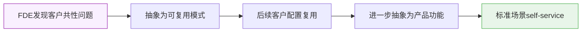

# FDE：Forward Deployed Engineer

> 来源：微信图解（2026-05-16）；结合 Palantir 公开产品文档与 FDE 角色公开信息
> 版本：D1 深化版（2026-05-20）

## 阅读前提

01 篇建立了 Ontology 语义层——把数据变成业务世界里有关系的对象。但语义层本身不会自动落地：它需要人把客户混沌的业务需求翻译成可以建模的结构，并在客户组织里推动起来。FDE 就是做这件事的角色。

---

## 一句话定义

FDE 是**深入客户一线、连接产品与客户成功的桥梁工程师**。

不是售前，不是实施顾问，是**既能写代码、又能懂业务**的复合型工程师，常驻客户现场。

---

## FDE 的本质：为什么这个角色存在

传统软件交付有一个结构性断层：

```
产品团队           ← 鸿沟 →          客户需求
（知道产品能做什么）               （知道业务要什么）
```

大多数企业 AI 项目失败，不是技术不行，而是：
- 技术团队不懂客户的业务场景
- 业务团队不懂如何把需求翻译成 AI 可执行的输入
- 中间没有人负责"让它真的跑起来"

FDE 就是填这个鸿沟的人。

---

## FDE 如何开展工作：四个身份为什么缺一不可

FDE 被描述为"技术专家 + 客户伙伴 + 问题解决者 + 推动者"——但四个词堆在一起并不说明问题。关键是：**拆掉任何一个，会发生什么？**

| 拆掉这个身份 | 剩余组合退化成 | 客户已有的替代品 |
|---|---|---|
| 技术专家 | 关系好、推进快、能协调问题 | 项目 PM（客户内部有） |
| 客户伙伴 | 技术强但缺业务 context，方案容易返工 | 远程技术顾问 |
| 问题解决者 | 关系好、推进快，遇到技术卡点就停摆 | 监理/项目协调员 |
| 推动者 | 解决眼前问题，但项目漂移、边界失控 | 驻场支持工程师 |

**结论**：四个身份互为前提——缺任何一个，FDE 就退化成客户"已经有的人"，存在理由消失。驻场办公不是形式要求，是建立信任资本的物理前提：没有信任，推动者身份没有地基。

> **反问：为什么不组成四人团队？** 这个表格能证明"四种能力缺一不可"，但任何复合角色都能用同样逻辑证明——比如"全栈工程师 = 前端 + 后端 + 运维 + 产品思维"。真正的问题是：**为什么需要一个人同时具备这四种能力？** 因为 FDE 的核心价值在于技术判断和业务判断**在同一时刻交汇**——需求讨论中当场判断"这个需求该不该建模为 Ontology 对象"，需要同时懂数据建模和客户业务。拆成四个人，每个判断都多一次沟通环节，判断密度就降回普通项目组了。

---

## 典型工作流程：五步框架 + FDE 特有的判断密度

"了解与调研 → 方案设计 → 实施集成 → 部署交付 → 持续优化"——这五步去掉"Palantir"三字，对任何实施项目都成立。FDE 的差异不在步骤，而在**每步之间的双轨判断**：

- **Step 1 → 2**：在客户混沌的需求里判断"哪些值得建 Ontology、哪些不该建"。这个判断没有标准答案，需要同时懂数据建模和客户业务，项目 PM 做不了。
- **Step 3**：技术可行性判断和业务优先级排序同步进行——哪个 API 先接，取决于哪条数据流最快创造客户可见的价值。
- **Step 5**：不是维护仪表盘，而是判断"现在是继续优化还是把模式固化成可复用资产"——这直接决定 Palantir 的商业模式能不能规模化。

这种技术视角与业务视角同步的持续判断，是 FDE 无法被项目经理或实施顾问替代的核心原因。

---

## FDE 不适合哪些场景（边界比范围更重要）

知道"用 FDE 来解决什么"，不如知道"什么情况下用 FDE 是错的"。

| 场景 | 为什么 FDE 不是答案 | 更合适的替代 |
|---|---|---|
| 需求明确，只需要执行开发 | FDE 核心价值是"判断什么该建"，需求已明确时这个价值消失 | 外包开发 |
| 客户只想买交付物，不打算建自主能力 | FDE 的终局是客户自立；客户不愿意，FDE 就是贵的外包 | 传统实施结项 |
| 产品高度标准化，self-service 覆盖度高 | CSM + 文档成本更低，FDE 溢价客户感知不到 | SaaS + Customer Success |
| 决策权碎片化，无跨部门推动通道 | 推动者身份需要信任资本，政治卡点靠技术无法解决 | 先解决组织问题 |

**反推**：FDE 真正适合的场景有三个共同特征——**场景足够复杂（有判断价值）**、**客户有意愿建立自主能力**、**FDE 有足够信任资本推动跨部门协作**。缺任何一个，FDE 模式都跑不出来。

---

## FDE vs 其他角色的边界

| 角色 | 核心职责 | 与 FDE 的区别 |
|------|----------|--------------|
| 售前工程师 | 演示、方案建议 | 不负责实施落地 |
| 实施顾问 | 流程梳理、培训 | 偏流程、弱技术 |
| 技术支持 | 答疑、Bug 处理 | 被动响应，非主动推进 |
| 开发工程师 | 写功能代码 | 不常驻客户，不懂业务 |
| **FDE** | **驻场+技术+业务+推动** | **以上所有的融合** |

---

## 关于 FDE 模式的挑战与终局

### FDE 模式的结构性矛盾

越优秀的 FDE，经验越深——但这些经验越锁死在个人身上。这是这个模式内嵌的矛盾：

| 挑战 | 表现 | 深层原因 |
|------|------|---------|
| 成本天花板 | FDE 只能服务有限客户，客均成本高 | 人力密集型，不可并行扩张 |
| 规模化瓶颈 | 优秀 FDE 极难复制 | 判断力和信任资本无法结构化传授 |
| 边界漂移 | 被客户当外包资源，项目范围失控 | 关系太紧密，说"不"的成本高 |

### 为什么说 FDE 是过渡形态

Palantir 自己在通过产品化手段"消解"FDE 的核心工作：

- FDE 手工建的 Ontology 数据模型 → Workshop 模板 + OSDK 脚手架
- FDE 在现场解决的配置问题 → AIP Assist 的自助引导（**已核实**：AIP Assist 是文档/平台导航助手，不操作 Ontology 数据，[来源](https://palantir.com/docs/foundry/assist/overview/)）
- FDE 做的培训与文档化 → 产品内嵌教程和 SDK 文档

**这不是 FDE 消亡，而是价值迁移**：从"完成工作"迁移到"建立可复用资产"。最终 FDE 只服务最复杂、最特化的场景，标准部署走 self-service。

---

## FDE 的演变弧线：从人力密集到资产沉淀

三个阶段的演变，与 Palantir 自身的产品化进程同步：

| 阶段 | 大致时期 | FDE 核心工作 | 知识沉淀载体 |
|------|---------|------------|------------|
| 1.0 手工作坊 | ~2010–2016 | 为每个客户定制开发，高度碎片化 | 几乎没有，经验留在个人 |
| 2.0 平台化 | ~2016–2021 | 围绕 Foundry/Ontology 配置集成 | Ontology Schema 模板、Pipeline 模式 |
| 3.0 自助化 | 2022– | OSDK/Workshop/AIP Assist 承接标准场景，FDE 退守复杂边缘 | OSDK 模式、Workshop App 模板 |

> 以上阶段划分为基于公开信息的分析性概括，具体时间节点 `[待核实]`。实际演变是渐进、重叠的，不是三个清晰的切分点。

### 知识如何从 FDE 流向产品



类比：好比资深工程师把反复解决的问题抽成框架——真正的价值不在于他每天写的代码，而在于他把**判断力编码进了工具**，让其他人不需要他也能做到 80% 的事。

**推论**：如果 FDE 的所有工作都只是"完成交付"，没有沉淀为可复用资产，这个 FDE 在消耗 Palantir 的商业模式，不是在强化它。

---

## FDE 模式的中国移植：三种变形

将 FDE 模式引入国内，面临一个结构性障碍：

> **Palantir FDE 给的是"能力转移"，国内甲方要的是"交付物"。**

Palantir 的逻辑：嵌入客户团队，帮他们建立自主 AI 能力，项目结束后客户可以独立运转。  
国内甲方的惯性：付钱，交系统，验收结项，出问题再找。

这个根本差异导致移植后出现三种变形：

### 变形 1：退化为"驻场外包"（最常见，也最危险）

| | 原版 FDE | 退化后 |
|--|---------|-------|
| 关系定位 | 战略合作伙伴 | 甲方的编外人力 |
| 工作重心 | 建 Ontology + 转移能力 | 按甲方要求开发功能 |
| 项目终态 | 客户能力自立 | 客户依然依赖乙方续约 |

参照对象：**Oracle/SAP 传统实施顾问**——很多最终演变成"现场答疑 + 帮客户改配置"。  
触发条件：乙方没有可复用底座，或甲方强势把 FDE 当人力外包使用。

### 变形 2：演变为"业务架构师"（理想型，但稀缺）

特征：双向翻译能力强（业务 ↔ 技术），有足够信任资本推动跨部门协作，自己少写代码但知道"该怎么建"。

参照对象：**互联网大厂的技术 PM / 业务架构师**，或 Salesforce Technical Architect。

出现条件：客户技术团队较弱、愿意高度信任外部专家做判断。在中大型国企和政务项目里偶尔存在，但属于例外。

### 变形 3：轻量化为"技术合伙人式 CSM"（创业场景）

特征：一人承担售前 + 实施 + 客户成功；用产品低代码能力压缩手工开发；以续费/扩展率而非工时计价。

参照对象：**Salesforce / HubSpot 生态里的 Solution Partner**。

适用条件：产品足够成熟（大量配置化场景），客户规模不足以支撑专职 FDE。

### 移植成功的三个前提

不管走哪种变形路径，成功移植需要：

1. **乙方有可复用底座**：不是纯人力驱动——否则 FDE 永远沦为外包
2. **甲方采购目标是"建能力"**：在传统项目制采购体系里极难，需要在合同层面明确
3. **FDE 有清晰的退出标准**：项目结束时，客户内部团队应能接手——这是检验移植成功的唯一指标
